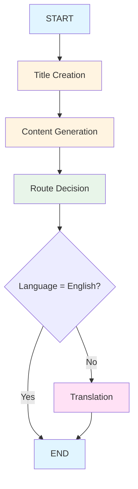
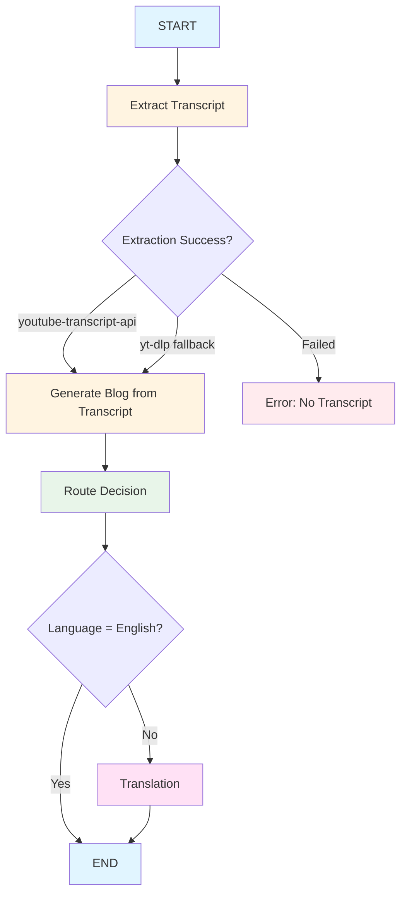

# Blog Generator AI

An intelligent blog generation application built with LangGraph that creates high-quality blog posts from topics or YouTube video transcripts. Features multi-language support, modern UI, and AI-powered content generation.

🌐 **Live Demo:** [https://blog-generator-agent-five.vercel.app/](https://blog-generator-agent-five.vercel.app/)

## Features

- 🎯 **Topic-Based Blog Generation** - Generate SEO-friendly blog posts from any topic
- 🎥 **YouTube Transcript Processing** - Convert YouTube videos into well-structured blog posts
- 🌍 **Multi-Language Support** - Generate and translate blogs in 8+ languages (English, Hindi, French, Telugu, Tamil, Malayalam, Japanese, Chinese)
- 🤖 **AI-Powered Content** - Uses Groq LLM with intelligent fallback mechanisms
- 📝 **Markdown Formatting** - Beautifully formatted blog content with proper structure
- 🎨 **Modern Frontend** - Responsive React UI with Tailwind CSS

## Tech Stack

**Backend:**
- Python 3.12+ | FastAPI | LangGraph | LangChain | Groq LLM | Pydantic | youtube-transcript-api | yt-dlp

**Frontend:**
- React 18 | Vite | Tailwind CSS | React Markdown | Axios | Lucide React

## How It Works

### Topic-Based Blog Generation

**Flow:**
1. Generate SEO-friendly title from topic
2. Create detailed blog content with Markdown formatting
3. Check target language via routing
4. Translate if needed (non-English languages)
5. Return final blog post

### YouTube-Based Blog Generation

**Flow:**
1. Extract transcript from YouTube URL (using youtube-transcript-api or yt-dlp fallback)
2. Generate title and content from transcript
3. Check target language via routing
4. Translate if needed (non-English languages)
5. Return final blog post

## Resources

- [Live Application](https://blog-generator-agent-five.vercel.app/)
- [LangGraph Documentation](https://github.com/langchain-ai/langgraph)
- [Groq API](https://console.groq.com/)
- [LangChain Documentation](https://www.langchain.com/)
- [FastAPI Documentation](https://fastapi.tiangolo.com/)
